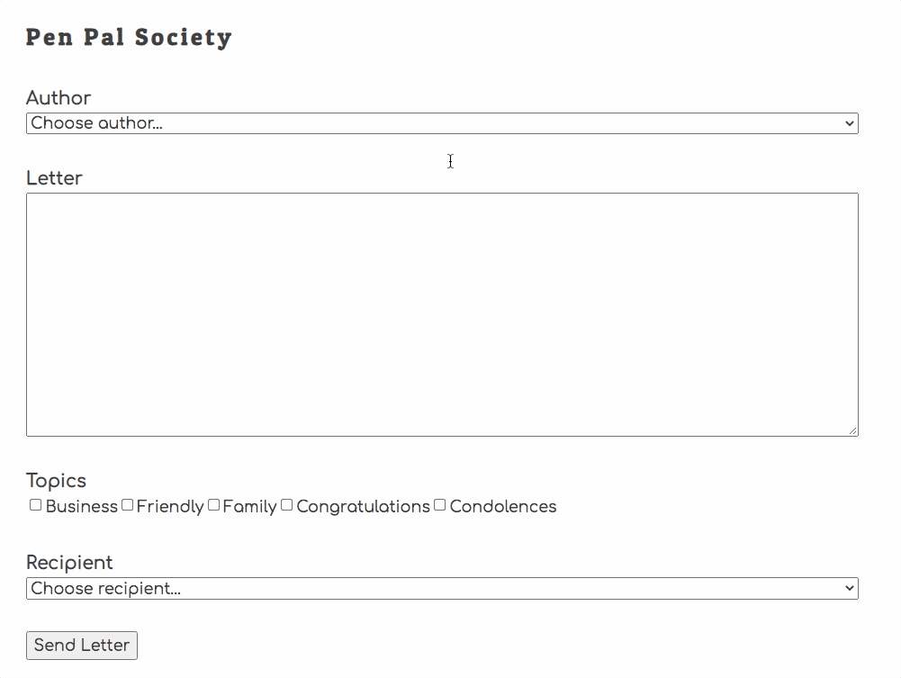

# The Pen Pal Society

For this project, you will be building a fairly simple user interface, but the coordination of the state of the project is the goal. The person using the application can choose an author for a letter, provide the body of the letter, choose 1+ topics for the letter, and then choose a recipient.

## The Data

Below is a description of the different state to be tracked and represented in your application. You will decide on what the key names are for each piece of state and what the data types should be.

### Pen Pals

You need a collection of objects that represent the people who are in the Pen Pal Society. Each pen pal must have the following properties.

* primary key
* full name
* email address

### Letters

You need a collection of objects that represent the letters that the members of the Pen Pal Society send to each other. Properties of the letter are.

* primary key
* letter body
* who sent it
* who received it
* date sent

### Topics

You need a collection of objects that represent the topics that can be assigned to each letter.

* primary key
* label of the topic

### Letter Topics

You need a collection of objects that represent the relationships between a letter and the topics chosen for it.

* primary key
* the letter
* the topic

### ERD

Before you write any code, or build your `database.json` file for your API service, build an ERD that visualizes this data and the relationships between each resource.

## Features

As stated above, this application is fairly simplistic in its feature set. You can fill out a form to create a letter, and then there is a list of letters displayed beneath the form. As you will discover, plain - even boring - applications can be technically sophisticated in their implementation. You will need to understand how to use `fetch()` and `then()`, have a solid understanding of state, and how to keep the API state and your application state in sync.

### Create Letter

* Create a module that generates a letter form
* When the Send button is clicked, collect the user input and save the letter information
* Store the new letter information in application state after it is created _(JSON Server responds with the newly created object when you submit a POST request)_
* If any of the checkboxes were selected, create a relationship object for each one in the API for the new letter
* After the letter, and its relationships to topics, is created, it should immediately be rendered in the list of letters.

### Display Letters

* Display a list of letters
* Each letter should display the author
* Each letter should display the recipient
* Each letter should display the letter body
* Each letter should display the date it was created
* Each letter should display its topics

